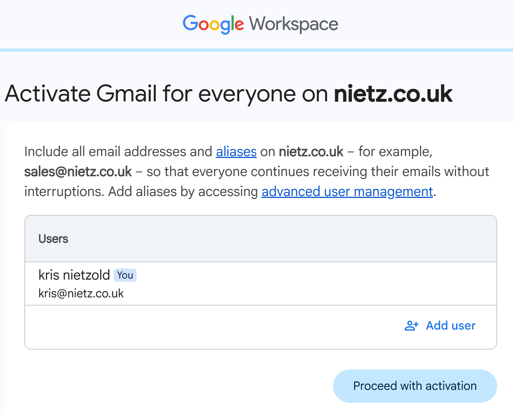
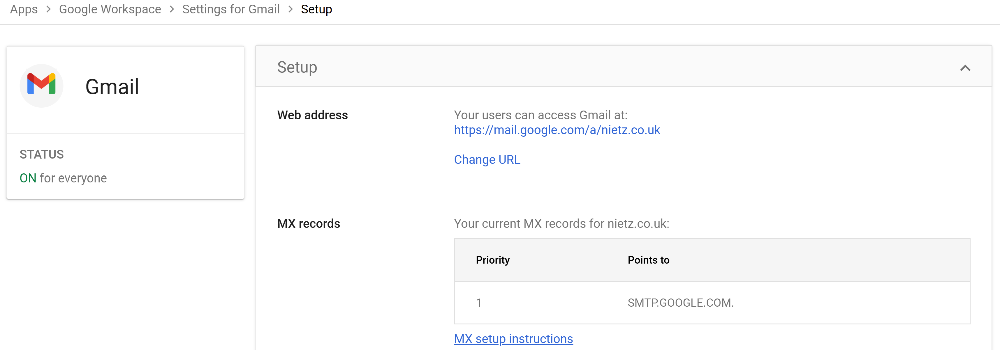
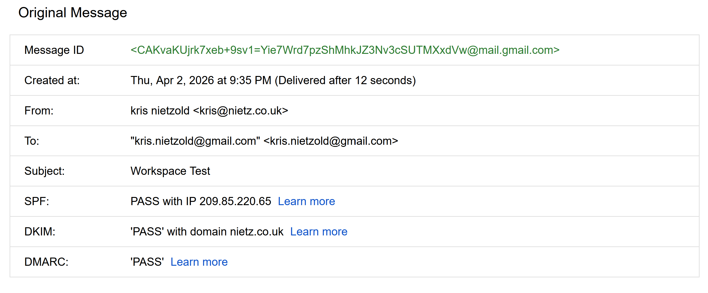
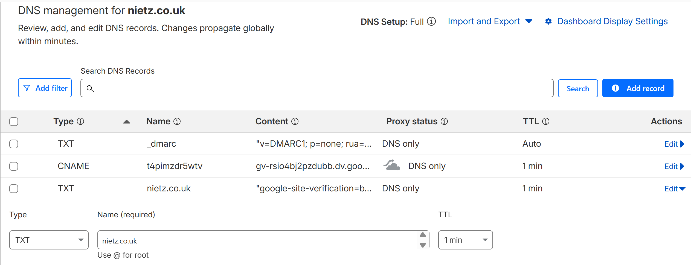

# 01. Domain & Email Configuration

This section demonstrates the setup of a custom domain with Google Workspace, including DNS verification and secure email configuration.

---

## Domain Verification

Domain ownership was verified using a DNS record provided by Google Workspace.

A CNAME verification record was added in Cloudflare DNS using the values supplied by Google.

After DNS propagation, the domain was successfully verified in Google Admin Console.

This process:
- Confirms ownership of the custom domain
- Enables Google Workspace services for the domain
- Provides a reliable DNS-based verification method

---

## Gmail Activation

Once the domain was verified, Gmail was enabled for users on the domain.

After activation, Gmail showed as enabled in the Admin console.

This step:
- Enables hosted email for the domain
- Allows users to send and receive mail through Google Workspace
- Prepares the environment for mail routing and authentication

---

## MX Records (Mail Routing)

Mail routing was configured in Cloudflare by creating an MX record pointing to Google’s mail servers.

This ensures:
- Inbound email is routed to Google Workspace
- Mail delivery for the domain is operational

---

## SPF (Sender Policy Framework)

An SPF TXT record was configured in Cloudflare to define which mail servers are authorised to send email on behalf of the domain.

Configured value:

`v=spf1 include:_spf.google.com ~all`

This helps:
- Reduce spoofing risk
- Improve message trust
- Support downstream DMARC validation

---

## DKIM (DomainKeys Identified Mail)

A DKIM key was generated in the Google Admin console for the domain.

The DKIM TXT record was then added in Cloudflare DNS.

After propagation and activation, email authentication checks confirmed successful DKIM signing.

This provides:
- Cryptographic validation of outgoing mail
- Improved deliverability
- Stronger protection against email tampering

---

## DMARC (Domain-based Message Authentication, Reporting and Conformance)

A DMARC TXT record was added to define how authentication failures should be handled and reported.

This provides:
- Visibility into SPF and DKIM alignment
- Reporting on authentication failures
- A foundation for stricter anti-spoofing enforcement later

---

## Summary

This configuration established a secure and functional Google Workspace email environment by combining:

- DNS-based domain verification
- Gmail activation
- MX-based mail routing
- SPF configuration
- DKIM signing
- DMARC policy enforcement

Together, these controls provide a production-ready baseline for secure email delivery and domain protection.
