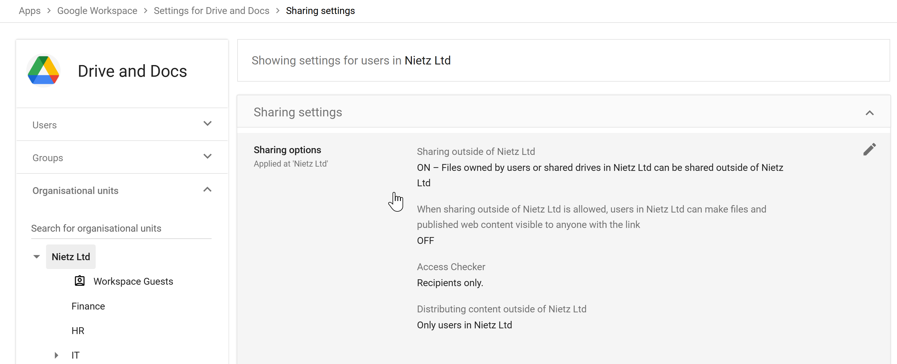
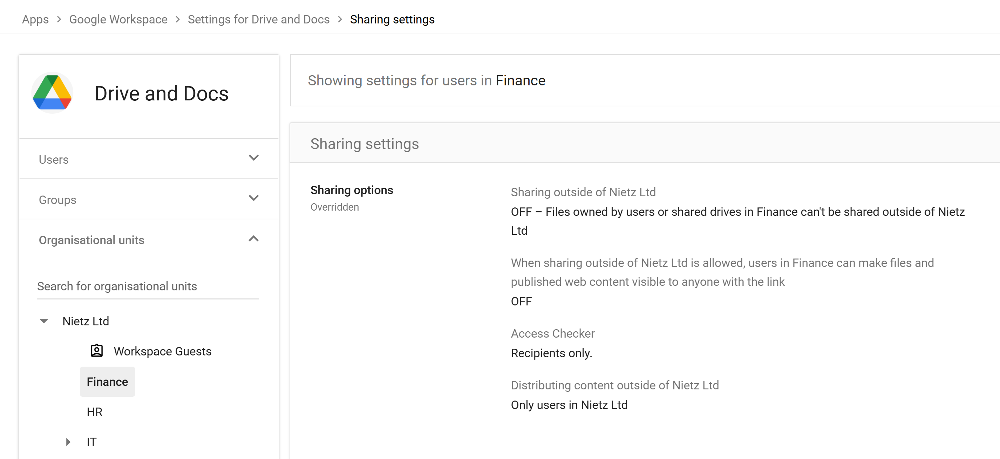
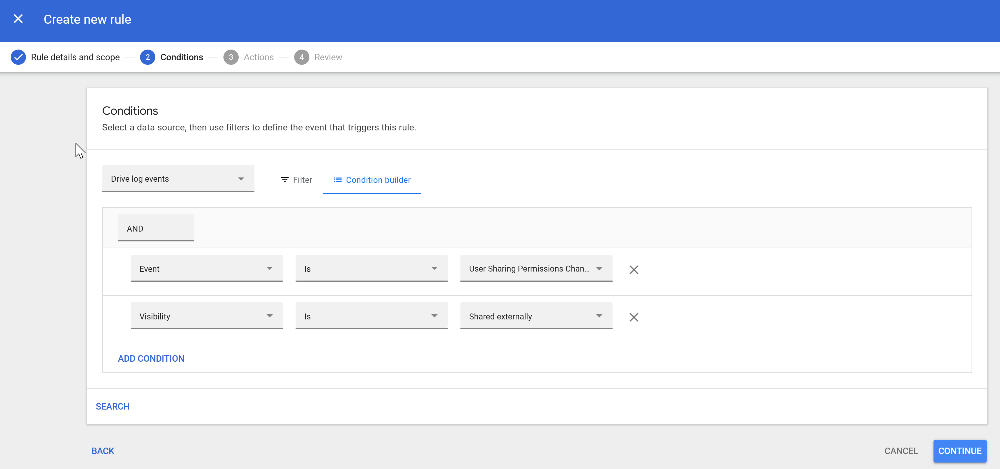
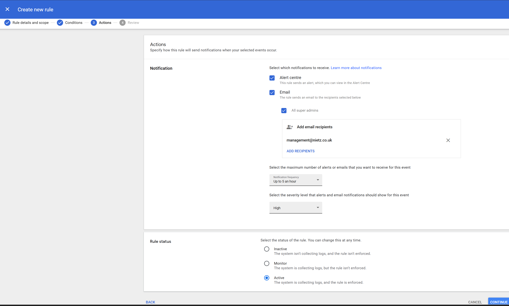
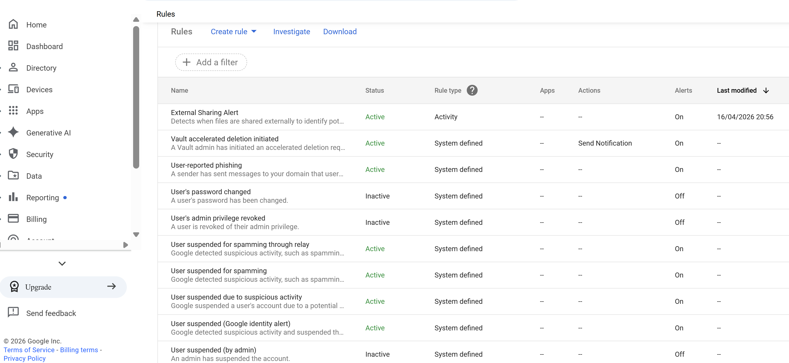
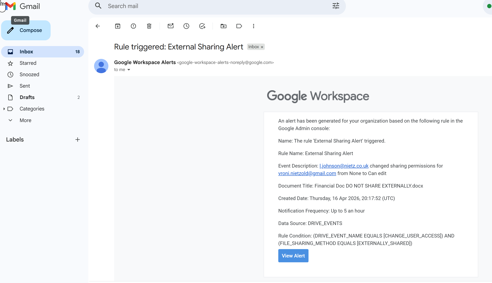

# 13 – Compliance & Data Protection

## Overview

This section demonstrates how data protection controls were implemented in Google Workspace to reduce the risk of data leakage and provide visibility into high-risk user behaviour.

A layered security approach was applied:

- **Prevention** – Restrict external sharing where appropriate  
- **Detection** – Monitor risky actions using audit logs  
- **Alerting** – Generate real-time notifications for security events  

This configuration builds directly on findings from **Section 12 (Reporting & Monitoring)**, where external sharing activity was identified.

---

## Drive Sharing Controls (Organisational Baseline)

Drive sharing settings were reviewed at the root organisational level to establish the default security posture.

### Configuration

- External sharing: **Enabled**
- Link sharing: **Restricted (no public link access)**
- Access Checker: **Recipients only**
- External distribution: **Controlled**

### Rationale

- Allows collaboration with external parties where required  
- Prevents uncontrolled public link sharing  
- Maintains usability for general business operations  

---

## Finance OU – Restricted Sharing Policy

Following audit findings, stricter controls were applied to the **Finance organisational unit**, where sensitive data is handled.

### Configuration

- External sharing: **Disabled**
- Policy: **Overridden from parent OU**
- Access Checker: **Recipients only**

### Security Impact

- Prevents any files from being shared outside the organisation  
- Enforces data containment for sensitive financial information  
- Demonstrates use of **OU-based policy segmentation**

---

## Detection – External Sharing Activity Rule

An activity-based rule was created to detect external sharing events in real time.

### Rule Logic

Trigger when:

- Event: **User sharing permissions change**
- Condition: **Visibility = Shared externally**

### Purpose

- Detect when users expose files outside the organisation  
- Provide visibility into potential data leakage events  

---

## Alerting Configuration

The rule was configured to generate alerts and notify key stakeholders.

### Configuration

- Alert Centre: **Enabled**
- Email notifications:
  - Super administrators
  - `management@nietz.co.uk`
- Severity: **High**
- Frequency: **Up to 5 per hour**

### Rationale

- Ensures rapid awareness of high-risk actions  
- Balances responsiveness with alert fatigue  

---

## Rule Activation

The rule was enabled to enforce continuous monitoring.

### Result

- Real-time detection of external sharing events  
- Automatic alert generation without manual intervention  

---

## Alert Validation (Test Scenario)

The configuration was validated by deliberately sharing a file externally.

### Outcome

The alert captured:

- User performing the action  
- External recipient email  
- File name  
- Permission change (e.g. Viewer → Editor)

### Conclusion

- Detection is functioning correctly  
- Alerts provide sufficient context for investigation  
- End-to-end monitoring workflow is confirmed  

---

## Data Residency (Platform Limitation)

Google Workspace supports **Data Regions** for controlling where data is stored.

In this lab:

- Not available due to **Business Standard plan**

### Production Use

- Enforce EU data residency (GDPR)  
- Meet regulatory and organisational requirements  
- Control location of sensitive data  

---

## Data Retention & eDiscovery (Platform Limitation)

Google Vault provides:

- Retention policies  
- Legal holds  
- eDiscovery across Workspace services  

In this lab:

- Not available due to **Business Standard plan**

### Production Use

- Preserve data for legal investigations  
- Enforce retention compliance  
- Perform forensic data analysis  

---

## Security Capabilities Demonstrated

- OU-based policy enforcement  
- Controlled external sharing  
- Real-time activity monitoring  
- Automated alerting for risky behaviour  
- End-to-end validation of detection pipeline  

---

## Summary

This section demonstrates a practical implementation of data protection controls in Google Workspace:

- Sensitive departments are restricted from external sharing  
- High-risk user actions are continuously monitored  
- External data exposure events are detected in real time  
- Alerts provide immediate visibility for investigation  

Together, these controls reduce the risk of data leakage and establish a strong foundation for organisational security and compliance.
